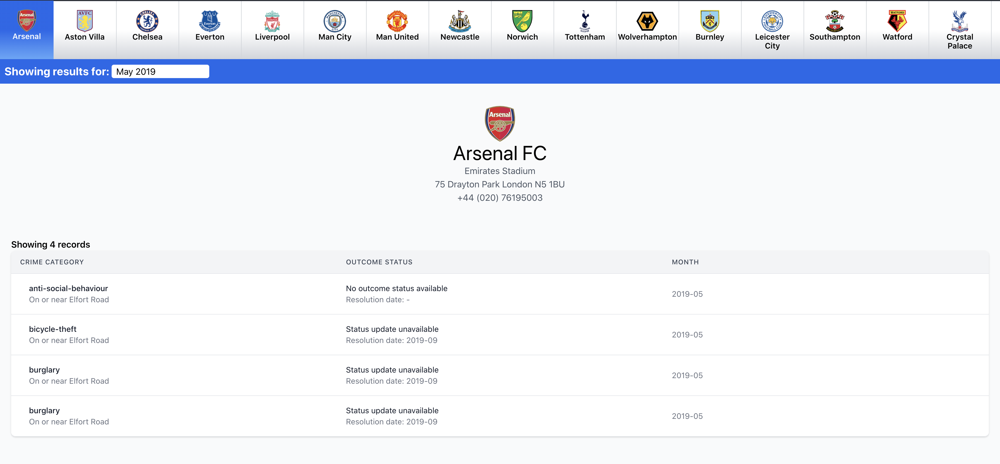
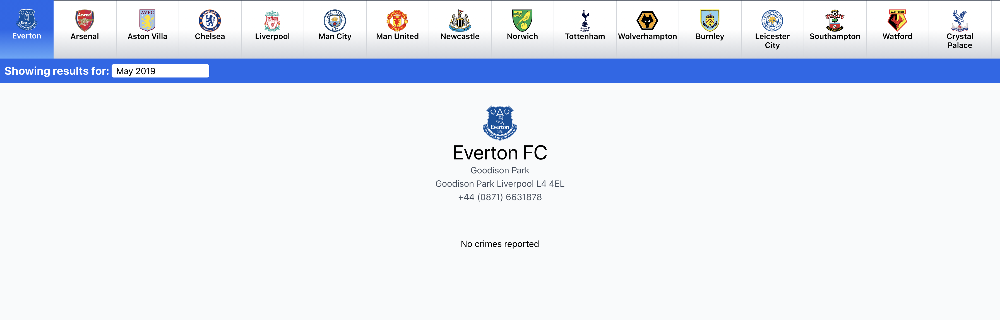
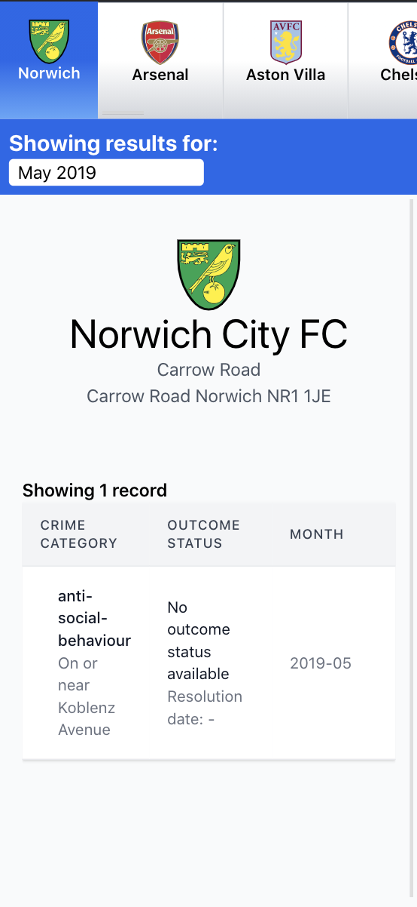

# Premier League Crime Viewer

This applications allows you to view the crimes at Premier League Stadium grounds sorted by month and year.

## Contents

1. [Working Demo](#working-demo)
2. [How to build locally](#how-to-build-locally)
3. [Observations & Issues](#observations-&-issues)
4. [Images](#images)

## Working Demo

A working demo of this application can be viewed [here](https://and-react-app-test.herokuapp.com/).

## How to build locally

1. Clone the repository.
2. `npm install` to install node dependencies.
3. Copy the contents of the `.env.example` file into a new file named `env.local`.
4. Request an API token from [here](https://www.football-data.org/client/register) and set the `REACT_APP_FOOTBALL_DATA_TOKEN` value to the token provided. For more information on how to set environment variables, click [here](https://create-react-app.dev/docs/adding-custom-environment-variables/).
5. Run `npm run build-css` to generate css.
6. Run `npm start` to start the application.
7. Run `npm run test` to run unit tests.

## Observations & Issues

1. The `crimes-by-location` API only returns a single month of crimes at a time, restricting the ability to sort.
2. A 404 error is thrown when trying to get teams for 2021. Due to this the default month and year is January 2020. <strong>NOTE:</strong> Currently the 404 error is caught and additionally the date picker has a max date of 31 January 2020 to prevent a user selecting the date.

## Images

### Desktop view - with data and without

### Mobile view (sample is iPhone X)

